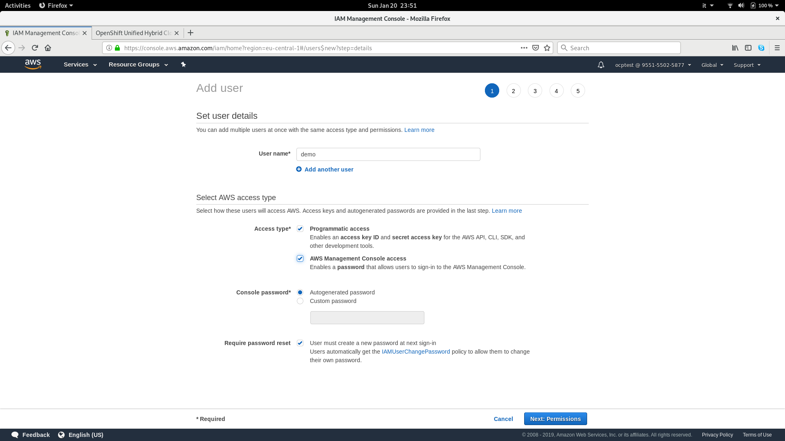

# Installazione di OpenShift 4.0 Developer Preview

La nuova release 4.0 di OpenShift Container Platform è ancora in sviluppo attivo
e vedrà nel primo quarter 2019 il rilascio della versione stable.
Il cambio di major version è essenzialmente legato all'acquisizione di CoreOS da
parte di Red Hat, avvenuta nel gennaio 2018 per la 250 milioni di dollari.
Questa acquisizione è stata strategica per l'integrazione di una serie di
tecnologie sviluppate da CoreOs, primi tra tutti **Container Linux** e gli
**Operators**.

Attualmente è possibile fare pratica con una developer preview basata su **OKD**
che prevede l'utilizzo del nuovo [**installer**](https://github.com/openshift/installer)
che sfrutta [**Terraform**](https://www.terraform.io/), progetto di Hashicorp
per il deployment e il configuration management di infrastrutture complesse.
L'installer è focalizzato sul deployment in cloud di OpenShift e andrà ad
affiancare l'attuale metodo di installazione basato su **Ansible** per i cluster
on premise.  
L'installer supporta attualmente soltanto due piattaforme: **AWS** e **OpenStack**.
Compilandolo da sorgente è possibile abilitare anche **Livbirt**, tuttavia
questa feature rimane soltanto ad appannaggio degli sviluppatori e non è
pensata per un uso in produzione.
Per questo walkthrough abbiamo pensato di utilizare AWS e testare così uno scenario
diffuso, di facile implementazione in un contesto cloud.

Lo sfruttamento di Terraform per questo approccio al deployment si rivela sin
da subito molto interessante per i potenziali sviluppi che ne derivano in
ambito di deployment su hybrid e public cloud. Terraform è un progetto Open
Source che permette di creare, versionare e gestire infrastrutture complesse
basandosi su un approccio di **infrastructure-as-code**. Tutta l'infrastruttura
viene mantenuta tramite file di configurazione che utilizzano un proprio DSL
(Domain Specific Language) per la configurazione in modo parametrico.
Tali configurazioni, nel nostro caso, sono generate dinamicamente nella fase
iniziale dell'installazione (Qui i riferimenti al codice: https://github.com/openshift/installer/tree/master/pkg/asset/installconfig).
Un aspetto molto bello di Terraform è la sua architettura modulare che prevede
l'uso di plugin per i vari providers (AWS, GCP, OpenStack, VSphere, ecc). I
providers disponibili sono moltissimi e questo lascia pensare ad un futuro
allargamento anche ad altre piattaforme cloud dell'attuale installer OpenShift.
L'elenco completo dei providers Terraform è su GitHub: https://github.com/terraform-providers.  

Come sempre, vale la pena clonare il repo Git di Terraform, che include solo la
parte core del codice, e studiarlo per comprenderene meglio il funzionamento:
https://github.com/hashicorp/terraform.   

## Operazioni preliminari
Dunque l'installer, tramite Terraform si occupa della creazione di tutte le risorse
del cluster in AWS EC2 e successivamente inietta nei nodi le configurazioni
necessarie per l'esecuzione dei vari servizi (containerizzati) del cluster.
Alla fine del processo di installazione si otterrà in output il link di accesso
alla console e le relative credenziali generate.

Come primo step sarà necessario loggarsi sul link della developer preview:
https://try.openshift.com/.


Cliccando sul tasto rosso "Getting Started" si verrà redirezionati sulla richiesta
di login con il proprio Red Hat Account:


Una volta autenticati verrà presentata una pagina contenente la guida passo
passo per il deploy del cluster OpenShift su AWS.


La guida è strutturata in 5 passaggi fondamentali:
1. Configurazione DNS
2. Configurazione credenziali AWS
3. Download dell'installer openshift
4. Deploy del cluster
5. Accesso al cluster da Console o CLI

### Configurazione DNS
Affinché l'installazione del cluster OpenShift possa essere completata con
successo è necessario registrare un dominio in AWS (o trasferire da un altro
registar uno già esistente) tramite il servizio **Route 53**.


La registrazione di un dominio .com o .net ha un costo che si aggira attorno agli
11-12 euro ed è utile anche per futuri test. Una volta completata la registrazione
del dominio questo apparirà tra le zone gestite e sarà visibile e utilizzabile
dall'installer.  
Verranno gestite due zone, una pubblica e una privata. Nella zona pubblica sarà
registrato un record A (quindi risoluzione IPv4) per l'endopoint API che punterà
ad un **Elastic Load Balancer** di AWS.

### Configurazione credenziali AWS
Dopo aver registrato un dominio è necessario configurare delle credenziali con
privilegi elevati che verranno usate durante l'installazione. Questo passaggio è
scarsamente documentato nella guida ma può essere riassunto nei seguenti passaggi:

1. Creazione di un utente dedicato sotto [IAM](https://console.aws.amazon.com/iam/home)
ovvero il servizio di Identity Access Management. Per fare questo cliccare su
"Add User" nella sezione Utenti.  


2. Durante la creazione dell'utente selezionare "Programmatic Access" per ottenere
un **access key ID** e una **secret access key** che saranno utilizzati da
Terraform durante l'installazione. Selezionare anche **AWS Management Console
access** (non necessario) se si vuole dare anche accesso alla console web tramite
password all'utente.



3. L'assegnazione di un gruppo all'utente è cruciale per la definizione dei pemessi,
ereditati dal gruppo stesso. Il gruppo deve avere un ruolo **AdministratorAccess**.
Future release dell'installer dovrebbero riuscire a limitare i privilegi necessari
per completare con successo il deploy del cluster.


4. Alla fine della procedura di creazione si potrà visualizzare un resoconto
contenente le info delle credenziali ed un comodo link per scaricare un file
**credentials.csv** contenente tutte le informazioni.


Con questo si conclude la fase preparatoria su AWS.

**Extra Tip**: può essere utile scaricare e installare anche la CLI di AWS per
eventuali operazioni di manutenzione/troubleshooting manuale. Su Fedora è
disponibile il pacchetto **awscli**:

```
$ sudo dnf install awscli
```

In alternativa può essere installata anche con **pip** (richiede Python 2.6.5 o
superiore).

```
$ pip install awscli
```

Versioni per altri OS e documentazione sono dispnibili qui: https://aws.amazon.com/cli/.

### Download dell'installer
Per procedere all'installazione è necessario scaricare l'installer da GitHub,
scegliendo tra quello buildato per il nostro OS e piattaforma: https://github.com/openshift/installer/releases

Attualmente vengono rilasciate soltanto build per Darwin x86_64 (OS X) e per
Linux x86_64. Eventuali altre architetture o sistemi operativi richiedono
una compilazione dedicata, dall'esito positivo non certo.

Una volta scaricata la versione corretta copiarla in una directory definita
sotto la variabile **$PATH**, preferenzialmente **/usr/local/bin**.

```
$ sudo mv openshift-install-linux-amd64 /usr/local/bin/openshift-install
$ sudo chmod +x /usr/local/bin/openshift-install
```

### Deploy del cluster
Giunti a questo punto si è pronti per il deploy del cluster. L'installer prevede
una parte interattiva da linea di comando in cui si dovranno passare le seguenti
informazioni:
- **Chiave SSH** (default public key o none)
- **Piattaforma** (AWS, OpenStack)
- **Credenziali AWS** (che verranno storate in *~/.aws/credentials*)
- **Region**
- **Base Domain** (sarà proposto il dominio precedentemente registrato)
- **Cluster name** (che verrà usato come prefisso nelle risorse create)
- **Pull secret** (scaricabile o copiabile dalla pagina di documentazione Red Hat)

Dopo aver fornito queste informazioni l'installazione partirà automaticamente.

```
[gbsalinetti@heisenberg OCP40]$ openshift-install create cluster
? SSH Public Key /home/gbsalinetti/.ssh/id_rsa.pub
? Platform aws
? Region eu-central-1
? Base Domain aextraordylabs.com
? Cluster Name ocp40-aws
? Pull Secret [? for help] *******************************************************************************************************************************************************************
INFO Creating cluster...                          
INFO Waiting up to 30m0s for the Kubernetes API...
INFO API v1.11.0+0583818 up                       
INFO Waiting up to 30m0s for the bootstrap-complete event...
INFO Destroying the bootstrap resources...        
INFO Waiting up to 10m0s for the openshift-console route to be created...
INFO Install complete!                            
INFO Run 'export KUBECONFIG=/home/gbsalinetti/Labs/OCP40/auth/kubeconfig' to manage the cluster with 'oc', the OpenShift CLI.
INFO The cluster is ready when 'oc login -u kubeadmin -p XXXXX-XXXXX-XXXXX-XXXXX' succeeds (wait a few minutes).
INFO Access the OpenShift web-console here: https://console-openshift-console.apps.ocp40-aws.aextraordylabs.com
INFO Login to the console with user: kubeadmin, password: XXXXX-XXXXX-XXXXX-XXXXX
```

Il tempo necessario per completare tutto il processo di deploy è circa 20 minuti,
al termine dei quali si avrà un cluster up and running. Il recap finale mostrerà
tutte le informazioni e credenziali necessarie ad accedere alla console.
Viene riportata la URL della Console ma non vengono stampate le info per
accedere direttamente alle API del cluster. Questa URL può essere facilmente
estrapolata da AWS oppure dal file di log dell'installazione andando a ricercare
la stringa "*Still waiting for the Kubernetes API*".

```
time="2019-01-19T23:14:58+01:00" level=debug msg="Still waiting for the Kubernetes API: Get https://ocp40-aws-api.aextraordylabs.com:6443/version?timeout=32s: dial tcp 18.153.5.207:6443: connect: connection refused"
```

Si noti, tra l'altro, che in questa installazione le API esposte sono sulla porta
tcp 6443.


### Accesso al Cluster
Per accedere al cluster da CLI è necessario scaricare e
installare la build più recente da questo link: https://mirror.openshift.com/pub/openshift-v3/clients/4.0.0-0.139.0/

Anche in questo caso selezionare la versione di OS e piattaforma corretti.

```
$ wget https://mirror.openshift.com/pub/openshift-v3/clients/4.0.0-0.139.0/linux/oc.tar.gz
$ tar zxvf oc.tar.gz
$ sudo mv oc /usr/local/bin
$ sudo chmod +x /usr/local/bin/oc
```

A questo punto ci si potrà autenticare con le credenziali fornite:

```
$ oc login -u kubeadmin -p XXXXX-XXXXX-XXXXX-XXXXX https://ocp40-aws-api.aextraordylabs.com:6443
```

Per testare il corretto funzionamento elenchiamo i namespace presenti:

```
$ oc get ns
NAME                                                      STATUS    AGE
default                                                   Active    1h
kube-public                                               Active    1h
kube-system                                               Active    1h
openshift                                                 Active    1h
openshift-apiserver                                       Active    1h
openshift-apiserver-operator                              Active    1h
openshift-cluster-api                                     Active    1h
openshift-cluster-kube-scheduler-operator                 Active    1h
openshift-cluster-machine-approver                        Active    1h
openshift-cluster-network-operator                        Active    1h
openshift-cluster-node-tuning-operator                    Active    1h
openshift-cluster-openshift-controller-manager-operator   Active    1h
openshift-cluster-samples-operator                        Active    1h
openshift-cluster-storage-operator                        Active    1h
openshift-cluster-version                                 Active    1h
openshift-config                                          Active    1h
openshift-config-managed                                  Active    1h
openshift-console                                         Active    1h
openshift-controller-manager                              Active    1h
openshift-core-operators                                  Active    1h
openshift-csi-operator                                    Active    1h
openshift-dns                                             Active    1h
openshift-dns-operator                                    Active    1h
openshift-image-registry                                  Active    1h
openshift-infra                                           Active    1h
openshift-ingress                                         Active    1h
openshift-ingress-operator                                Active    1h
openshift-kube-apiserver                                  Active    1h
openshift-kube-apiserver-operator                         Active    1h
openshift-kube-controller-manager                         Active    1h
openshift-kube-controller-manager-operator                Active    1h
openshift-kube-scheduler                                  Active    1h
openshift-machine-config-operator                         Active    1h
openshift-monitoring                                      Active    1h
openshift-node                                            Active    1h
openshift-operator-lifecycle-manager                      Active    1h
openshift-operators                                       Active    1h
openshift-osin                                            Active    1h
openshift-sdn                                             Active    1h
openshift-service-cert-signer                             Active    1h
```

Si può notare da subito un aumento notevole del numero di namespace/progetti
dovuto alla riorganizzazione di alcune risorse. Su questo tema si tornerà
successivamente.
Dal punto di vista architetturale si può notare subito l'esistenza di una
molteplicità di Operators che gestiscono gli elementi core del cluster (apiserver,
controller manager, scheduler, ecc).
Tra le novità più salienti da questo punto di vista vi sono:
- Il nuovo **openshift-ingress-operator** che gestisce la creazione del router  
  HAProxy nel namespace **openshift-ingress**. Il router abbandona quindi il
  vecchio namespace **default**.
  ```
  $ oc get pods -n openshift-ingress
  NAME                              READY     STATUS    RESTARTS   AGE
  router-default-55654bf7b7-9sprj   1/1       Running   0          1h
  ```
- Il nuovo **openshift-image-registry-operator** che gestisce la creazione del
  registry nel namespace **openshift-image-registry**.
  ```
  $ oc get pods -n openshift-image-registry
  NAME                                               READY     STATUS    RESTARTS   AGE
  cluster-image-registry-operator-6c4478c54c-gqdmh   1/1       Running   0          1h
  image-registry-748c65dddb-62m27                    1/1       Running   0          1h
  registry-ca-hostmapper-4s8d7                       1/1       Running   0          1h
  registry-ca-hostmapper-g6q92                       1/1       Running   0          1h
  registry-ca-hostmapper-krkdc                       1/1       Running   0          1h
  registry-ca-hostmapper-mzvln                       1/1       Running   0          1h
  registry-ca-hostmapper-qlf54                       1/1       Running   0          1h
  registry-ca-hostmapper-zknbk                       1/1       Running   0          1h
  ```
- Gli operator **openshift-apiserver-operator** e **openshift-kueb-apiserver-operator**
  che gestiscono installazione e lifecycle delle API del cluster.
- **openshift-cluster-network-operator** che deploya tutta la SDN.
- **openshift-dns-operator**, che gestisce il deploy del CoreDNS.

Se API, Controller Manager e Scheduler hanno ora i loro namespace dedicati, i
pod **Etcd** sono nel namespace **kube-system**:

```
$ oc get pods -n kube-system
NAME                                                       READY     STATUS    RESTARTS   AGE
etcd-member-ip-10-0-3-172.eu-central-1.compute.internal    1/1       Running   0          1h
etcd-member-ip-10-0-31-254.eu-central-1.compute.internal   1/1       Running   0          1h
etcd-member-ip-10-0-47-234.eu-central-1.compute.internal   1/1       Running   0          1h
```


## La nuova Console
Per accedere da Console inserire nella barra degli indirizzi del browser la URL
prodotta a fine installazione per giungere alla pagina di login di OKD.


Una volta autenticati si accederà alla nuova Console **unificata** di OpenShift
4.0:


Si può notare da subito il bel lavoro di riordino che è stato fatto nel tentativo
di convogliare tutta una serie di nuove e vecchie features in un'unica Console
più completa e pulita. Infatti, se nella CLI non vi sono particolari novità di
rilievo (tranne, per citarne uno, la rimozione del comando **oc adm diagnostics**),
è nella console che troviamo il vero rinnovamento della user experience di questa
nuova release.

Ogni bottone del menu verticale si espande ora nello stesso spazio del menu
stesso e non lateralmente, lasciando la vista della schermata principale libera.


La sezione **Home -> Projects** riporta l'elenco dei progetti attivi in OpenShift
e il bottone per crearne di nuovi.

### Il Catalog
La parte di certo più importante di questa nuova Console è il Catalog, che
permette di accedere alla più importante novità: la gestione degli **Operators**.
Gli Operators sono un progetto CoreOS che definisce un pattern di gestione delle
risorse Kubernetes tramite l'estensione di API e la creazione di **Custom
Resource Definitions** (CRD) gestite tramite dei **Controller** dedicati.
In parole povere, gli Operator sono dei binari che implementano la logica di
gestione delle applicazioni in grado di gestire caratteristiche specifiche di
ogni singola app. Gli Operators permettono di semplificare di molto la gestione
di applicazione stateful in Kubernetes come database, cache o sistemi di monitoring.
Tutti possono scrivere Operators, grazie all'Operator SDK: https://github.com/operator-framework/operator-sdk.

Gli operator vengono gestiti all'interno di OpenShift dall'**Operator Lifecycle
Manager**, di fatto un altro Operator che gestisce il funzionamento di tutti gli
altri.

Il catalog è composto da una sezione **Developer Catalog** che espone i noti
Template e Image Stream di OpenShift:


In questa sezione, al di là del diverso layout, poco è cambiato rispetto alle
precedenti release.

Nella sezione **Operators** è possibile visualizzare gli Operator attivi:


Per aggiungere nuovi Operators si utilizza il menu **Operator Management** in cui
è possibile scegliere tra Operator per per diversi scopi. Tra questi, as esempio:
- Etcd Operator
- Prometheus Operator
- AMQ Streams Operator
- MongoDB Operator


Nella release Stable di OpenShift 4.0 sarà possibile inoltre accedere a nuovi
Operators sviluppati da Red Hat e da terze parti tramite il menu **Marketplace**.

E' possibile in pochissimi click creare un nuovo operator a partire da quelli
disponibili. Ad esempio per creare un Operator Etcd, in grado di deployare e
gestire cluster Etcd nei vari namespace, è sufficiente cliccare sul bottone
"**Create Subscription**": il nuovo Operator Etcd sarà deployato nel namespace
**openshift-operator-lifecycle-manager** e apparirà nel menu Operators:


Cliccando sul nuovo Etcd Operator si potrà accedere alle funzionalità esposte,
ovvero:
- Creazione di un nuovo cluster Etcd
- Backup di un cluster Etcd
- Restore di un cluster Etcd


Nella sezione **Etcd Cluster** si può creare in pochi secondi un nuovo cluster
Etcd, specificando i parametri richiesti nella CRD definita dall'Operator.


La possibilità di creare i propri custom Operators tarati sui propri specifici workload
applicativi spalanca le porte ad un nuovo scenario di Deployment intelligenti,
di certo un'occasione importante per elevare le caratteristiche di automazione
di kubernetes ad un livello successivo. La previsione pressoché certa è che ve
ne saranno sempre di più.

### Workloads
La sezione Workloads contiene tutto ciò che è inerente alla gestione delle
applicazioni in esecuzione, nel dettaglio:
- Pods
- Deployments
- Deployment Configs
- Stateful Sets
- Secrets
- Config Maps
- Cron Jobs
- Jobs
- Daemon Sets
- Replica Sets
- Replication Controllers
- HPAs (Horizontal Pod Autoscalers)

La sezione **Workloads -> Pods** mostra i pod attivit nei vari progetti. E'
possibile selezionare un singolo progetto nel menù a tendina in alto o Selezionare
**All Projects** per vedere le risorse di tutti i progetti contemporaneamente.


La sezione **Workloads -> Deployments** mostra i Deployments esistenti. Si noti
il progressivo shift dalle **Deployment Configs** di OpenShift verso i
**Deployment** Kubernetes. Si può vedere da subito un altro aspetto importante:
tutti i componenti cruciali del cluster sono deplyoati tramite un Operator che
ne gestisce correttamente il ciclo di vita.


### Network
La sezione Network della console prevede la gestione di **Services**, **Routes**,
**Ingress** e **NetworkPolicies**.


Tra le rotte vi sono esposte anche le URL per accedere alla dashboard di
Grafana e di Prometheus, nonché la rotta che espone il registry esternamente:


### Storage
Questa sezione comprende la gestione di **PersistentVolumes**, **PersistentVolumesClaims**,
e **StorageClasses**. In questo scenario non sono utilizzati PV o PVC ma è
definita una default StorageClass basata sul provisioner **kubernetes.io/aws-ebs**,
quindi per il provisioning di Elastic Block Storage AWS.


### Builds
La sezione Builds comprende la gestione di **Build Configs**, **Builds** e
**ImagesStreams**. Anche in questa parte non vi sono novità da segnalare rispetto
alle release precedenti.
La visualizzazione delle Build Config gode di una distinzione per tipologia
(Docker, JenkinsPipeline, Source, Custom) con contatori per ognuna.


Nella sezione Image Streams è possibile non solo visualizzare i vari Image Stream
per ogni progetto ma anche crearne di nuovi:


### Monitoring
La sezione Monitoring contiene importanti novità sotto il profilo della gestione
del cluster OpenShift. Al suo interno si trova infatti una sottosezione **Alerts**
che contiene tutta una serie di allarmi configurati tramite l'AlertManager di
Prometheus che permettono di tenere il cluster ben sotto controllo.


Una comoda tabella sintetica in alto mostra un conteggio di degli alert
scatenati (Firing), di quelli silenziati (Silenced), di quelli Pending e di
quelli non scatenati (Not Firing).
Inutile dire quanto fosse importante e necessaria una feature del genere nella
gestione di OpenShift.

### Administration
Quella che era la **Cluster Console** in OpenShift 3.11, ereditata dal CoreOS e
ottima (e richiesta) new feature, è ora confluita interamente nella nuova Console
unificata in questa sezione.  
Da qui si possono gestire:
- Namespaces
- Nodi
- Machine Sets
- Machines
- Cluster Settings
- Service Accounts
- Roles
- Role Bindings
- Resource Quota
- Limit Ranges
- CRD

Una mezione particolare meritano i (relativamente) nuovi concetti di **Machines**,
**Machine Sets**.  
Machines e Machine Sets sono API facenti parte di un progetto denominato
[**Cluster API**](https://github.com/kubernetes-sigs/cluster-api) il cui scopo è
quello di definire un approccio dichiarativo, per la creazione, configurazione e
gestione di un cluster Kubernetes. Si tratta di API principalmente orientate alla
gestione dei nodi del cluster. Su di esse è stato creato un operator dedicato,
il [**Machine API Operator**](https://github.com/openshift/machine-api-operator),
che si occupa di creare e gestire una serie di Controllers e di Custom Resource
Definitions (CRD) che fanno enforcing delle configurazioni dei nodi tramite le
Cluster API sopra descritte.
Nella Console troviamo riferimenti ai Machine Sets definiti in questo cluster:


Nonché riferimenti alle Machines che hanno una corrispondenza univoca con i
nodi del cluster:


Appare chiaro che lo scopo delle Cluster API è quello di fornire un meccanismo
di provisioning standardizzato su vari tipi di Cloud Provider, piuttosto che
per supportare installazioni on premise.
Per questo nei SIGS (Special Interest Groups) Kubernetes è possibile
trovare già una serie di progetti dedicati ai vari, specifici providers:
- https://github.com/kubernetes-sigs/cluster-api-provider-openstack
- https://github.com/kubernetes-sigs/cluster-api-provider-aws
- https://github.com/kubernetes-sigs/cluster-api-provider-gcp
- https://github.com/kubernetes-sigs/cluster-api-provider-vsphere
- https://github.com/kubernetes-sigs/cluster-api-provider-azure
- https://github.com/kubernetes-sigs/cluster-api-provider-digitalocean

Una particolare menzione finale in questa sezione per le Custom Resource Definitions
(CRD), che sono definizioni di nuove risorse che vanno ad estendere le API di
Kubernetes. In questa sezione si possono visualizzare o modificare le esistenti ed
 è possibile creare nuove CRD:


## Conclusioni
La nuova versione di OpenShift è sicuramente un importante passo avanti grazie
all'integrazione delle tecnologie CoreOS e, grazie agli Operators, apre nuove
e interessanti possibilità di sviluppo e gestione di applicazioni Kubernetes
native.
In futuro un articolo su come creare un Operator custom partendo dall'Operator
SDK.
